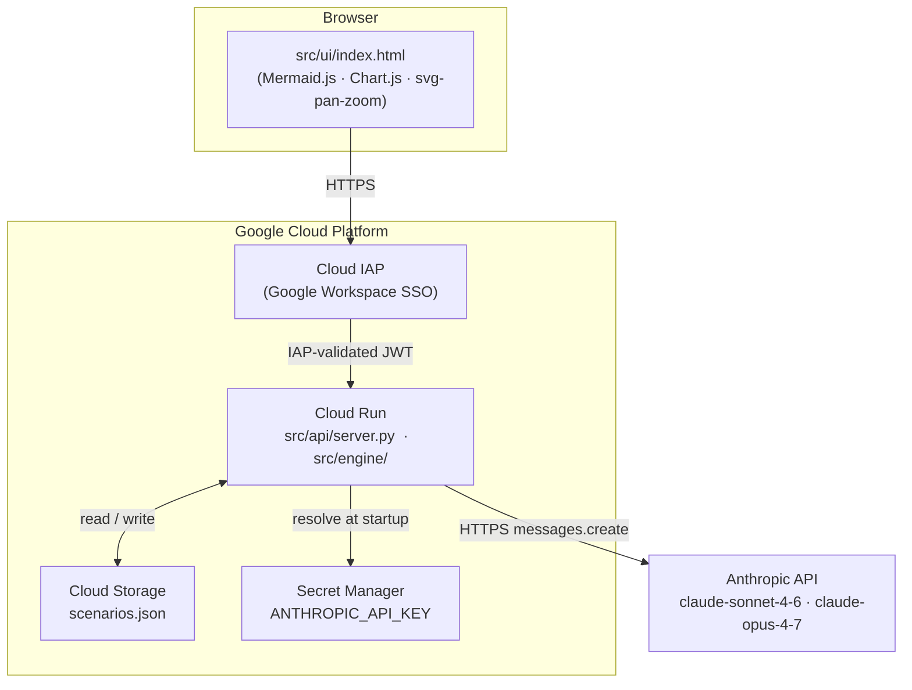
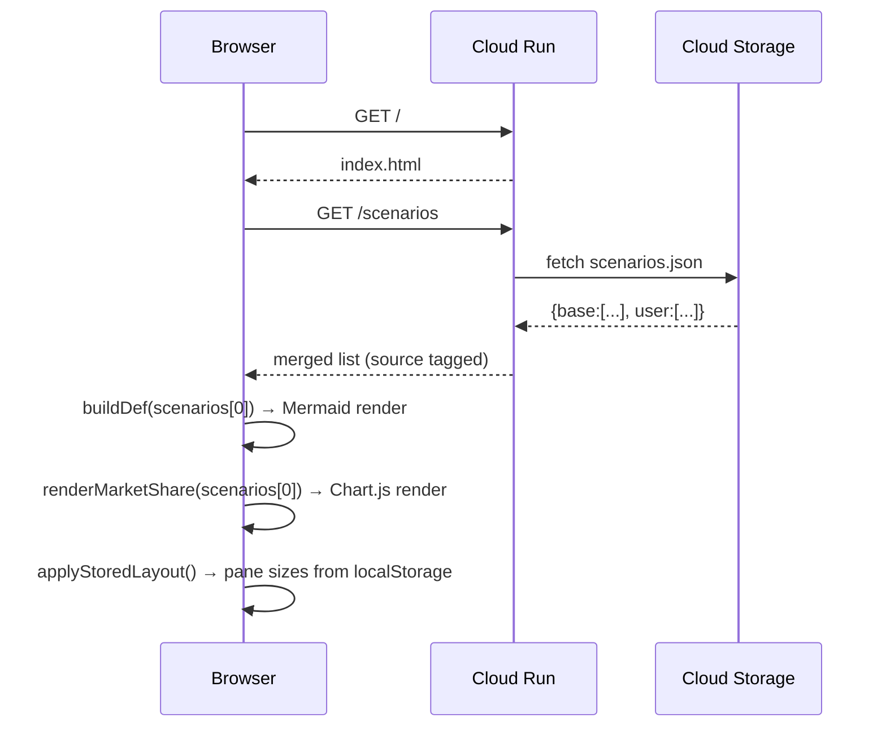
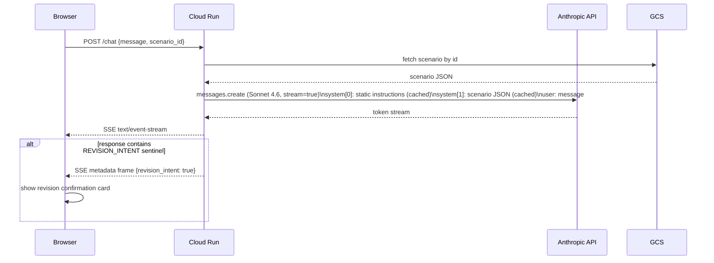
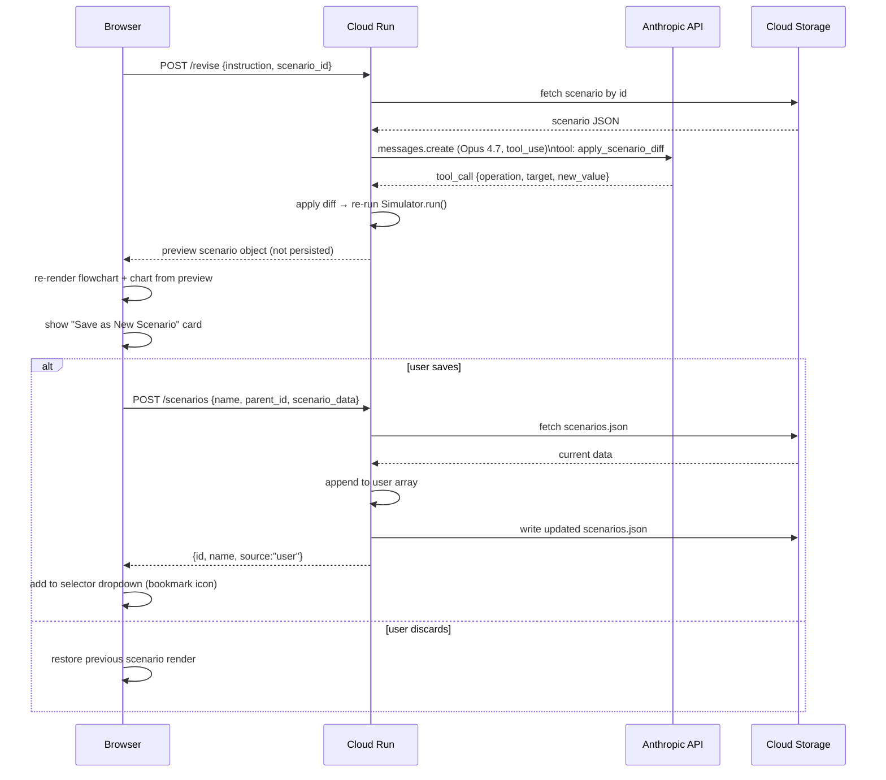
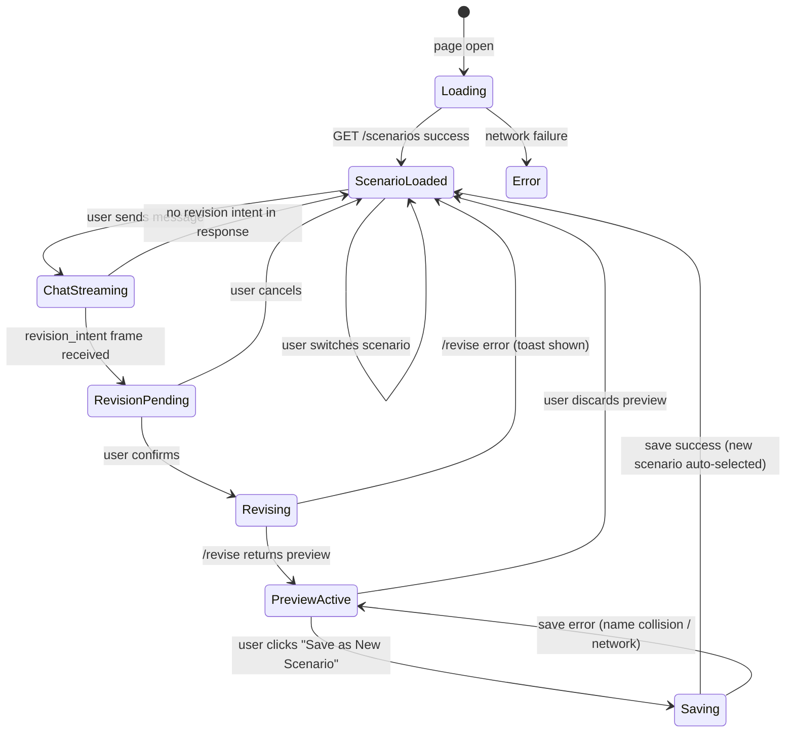
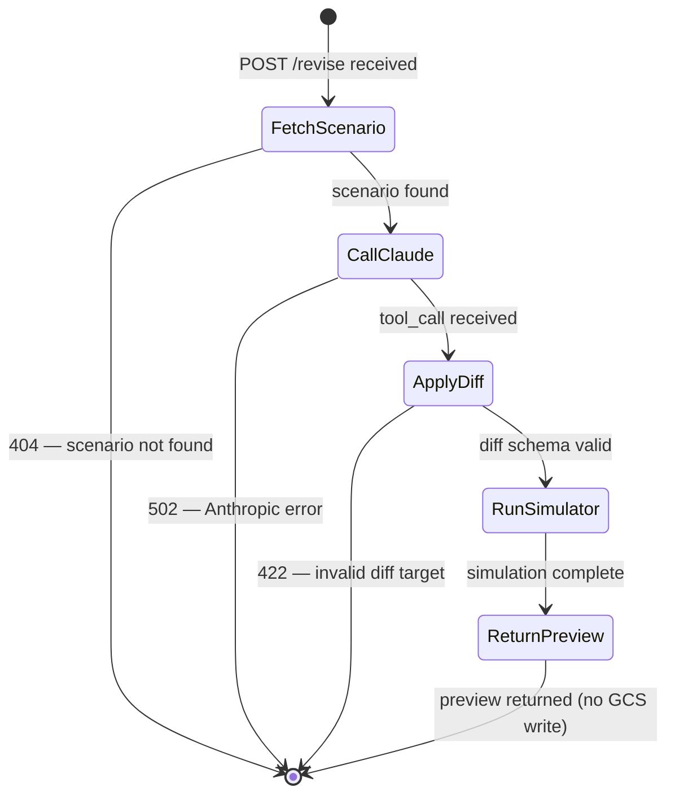

# System Design: Strategic Roadmap OTA Visualizer

## 1. Architecture Overview

Three-tier system: a browser-side SPA, a stateless FastAPI service, and the Anthropic API. On Google Cloud Platform, all ingress routes through Cloud IAP so only users authenticated via Google Workspace can reach the service.



The API layer is the only component that performs I/O. The simulation engine is a pure function of its inputs with no side effects.

---

## 2. Directory Structure

```text
Strategic-Roadmap/
├── data/
│   └── scenarios.json          # {base: [...], user: [...]} scenario arrays
├── src/
│   ├── engine/
│   │   ├── schema.py           # Pydantic models: Scenario, Node, Branch,
│   │   │                       #   CompetitorProfile, CompetitorState, MetricsSnapshot
│   │   └── simulator.py        # 2x2+S Fit Engine; project_market_shares()
│   ├── api/
│   │   └── server.py           # FastAPI: /chat (SSE), /revise, /scenarios CRUD
│   └── ui/
│       └── index.html          # Single-file SPA; served as static by FastAPI
├── tests/
│   ├── test_turning_points.py
│   └── test_wargame.py
├── specs/
│   ├── user_story.md
│   ├── implementation_plan.md
│   └── design.md               # This document
├── docs/
│   └── walkthrough.md
├── Dockerfile                  # Cloud Run container image
├── cloudbuild.yaml             # Cloud Build CI/CD pipeline
└── .env.example                # Local dev env vars template
```

---

## 3. Component Design

### 3.1 Engine Layer (`src/engine/`)

| Module | Responsibility |
| --- | --- |
| `schema.py` | Pydantic models for all domain objects; validates `scenarios.json` on load |
| `simulator.py` | `Simulator.run(scenario)` — applies PESTEL shocks through the 2x2+S matrix to produce per-year competitor states; `project_market_shares()` — reshapes competitor states into `{name: [(year, share)]}` normalized to sum = 1.0 per year |

The simulator is **pure**: no file I/O, no network calls. The API layer owns loading, persisting, and diffing.

### 3.2 API Layer (`src/api/server.py`)

| Endpoint | Method | Description |
| --- | --- | --- |
| `/` | GET | Serve `src/ui/index.html` |
| `/scenarios` | GET | Return merged `base + user` list; each entry tagged `source: "base"\|"user"` |
| `/scenarios` | POST | Save new named scenario to `user` array; rejects base-name collisions |
| `/scenarios/{id}` | PUT | Rename / update metadata of a user scenario (403 for base) |
| `/scenarios/{id}` | DELETE | Remove user scenario (403 for base) |
| `/scenarios/{id}/export` | GET | Download `{name}.scenario.json` (available for base and user) |
| `/scenarios/import` | POST | Multipart `.scenario.json` upload; validates schema, assigns fresh UUID |
| `/chat` | POST | SSE stream via Claude Sonnet 4.6 with cached scenario context |
| `/revise` | POST | Claude Opus 4.7 with `apply_scenario_diff` tool; returns preview only — no write |

**Scenario persistence on stateless Cloud Run:** every read/write calls the `google-cloud-storage` Python client against the configured `GCS_BUCKET`. Writes atomically replace the object. For local dev, falls back to `data/scenarios.json` on disk when `GCS_BUCKET` is unset.

### 3.3 UI Layer (`src/ui/index.html`)

Single HTML file, no build step. All dependencies via CDN:

| Library | Use |
| --- | --- |
| Mermaid.js 10.x | `flowchart LR` DAG rendering |
| Chart.js 4.x | Market-share comparison chart |
| svg-pan-zoom 3.x | Pan / zoom / fit on the rendered SVG |

Key JS functions (inline in the file):

| Function | Responsibility |
| --- | --- |
| `buildDef(scenario)` | Generates Mermaid source string from scenario JSON |
| `attachSvgHandlers()` | Binds hover/click to SVG `g.node` elements after each render |
| `renderMarketShare(scenario)` | Builds Chart.js dataset from `market_share_projection` |
| `streamChat(message)` | Opens SSE to `/chat`; routes `revision_intent` frames to the confirmation card |
| `previewRevision(instruction)` | Calls `/revise`, renders preview, shows Save / Discard card |
| `applyStoredLayout()` | Reads `ota-roadmap-layout-v1` from `localStorage`; applies pane sizes |

---

## 4. Data Flow

### 4.1 Initial Load



### 4.2 AI Chat



### 4.3 Revision Preview and Save



---

## 5. State Transitions

### 5.1 UI State Machine



### 5.2 `/revise` Endpoint State



---

## 6. LLM Integration

### 6.1 `/chat` — Claude Sonnet 4.6 (Streaming)

Prompt caching on the scenario block avoids re-tokenizing ~10 KB of JSON on every turn within the same session (cache TTL = 5 min; typical session lifetime is well under that).

```python
client.messages.create(
    model="claude-sonnet-4-6",
    max_tokens=1024,
    system=[
        {
            "type": "text",
            "text": SYSTEM_PROMPT,           # static instructions
            "cache_control": {"type": "ephemeral"}
        },
        {
            "type": "text",
            "text": json.dumps(scenario),    # large; static within session
            "cache_control": {"type": "ephemeral"}
        }
    ],
    messages=[{"role": "user", "content": user_message}],
    stream=True
)
```

The system prompt instructs the model to append the literal sentinel `<!-- REVISION_INTENT -->` when the user message implies a data change. The server strips this string and emits a separate SSE metadata frame `data: {"revision_intent": true}` before closing the stream, so the UI can react without parsing prose.

### 6.2 `/revise` — Claude Opus 4.7 (Tool Use)

`tool_choice` is forced so the model always returns the structured patch — no prose fallback that would require free-text parsing.

```python
client.messages.create(
    model="claude-opus-4-7",
    max_tokens=512,
    tools=[{
        "name": "apply_scenario_diff",
        "description": "Return a structured patch to apply to the scenario.",
        "input_schema": {
            "type": "object",
            "properties": {
                "operation": {
                    "type": "string",
                    "enum": ["update", "add", "delete"]
                },
                "target": {
                    "type": "string",
                    "description": "JSONPath-style pointer, e.g. 'nodes[id=tp2025].probability'"
                },
                "new_value": {
                    "description": "Any JSON value; omit for delete operations."
                }
            },
            "required": ["operation", "target"]
        }
    }],
    tool_choice={"type": "tool", "name": "apply_scenario_diff"},
    messages=[{"role": "user", "content": revision_instruction}]
)
```

After applying the diff the server re-runs `Simulator.run()` to regenerate `market_share_projection` and returns the full preview scenario. Nothing is written to GCS until the user explicitly saves.

---

## 7. Google Cloud Deployment

### 7.1 Infrastructure Layout

```text
Google Cloud Project (ota-roadmap)
│
├── Cloud Run  ota-roadmap
│   ├── Image: REGION-docker.pkg.dev/PROJECT/ota-roadmap/ota-roadmap:TAG
│   ├── Region: asia-northeast1
│   ├── Concurrency: 80 (default)  Min instances: 0  Max: 3
│   ├── --no-allow-unauthenticated  (IAP handles all auth)
│   └── Env vars
│       ├── GCS_BUCKET          → ota-roadmap-data
│       ├── ANTHROPIC_API_KEY   → injected from Secret Manager
│       └── ROADMAP_API_KEY     → local-dev fallback; ignored when IAP active
│
├── Cloud Storage  gs://ota-roadmap-data
│   └── scenarios.json
│
├── Secret Manager
│   └── anthropic-api-key  (version bound to Cloud Run service account)
│
└── Cloud IAP
    └── Backend: Cloud Run  ota-roadmap
        └── IAP access: roles/iap.httpsResourceAccessor
            → domain:yourcompany.com
```

### 7.2 Authentication

Cloud IAP fronts Cloud Run and validates the user's Google Workspace identity. It injects a signed `X-Goog-IAP-JWT-Assertion` header on every request. No custom `ROADMAP_API_KEY` is needed in production.

To prevent the bearer-token path from silently bypassing IAP in a misconfigured deploy, the server only reads `ROADMAP_API_KEY` when the environment variable `IAP_DISABLED=true` is explicitly set. In all other cases the token is ignored.

### 7.3 Dockerfile

```dockerfile
FROM python:3.12-slim

WORKDIR /app
COPY requirements.txt .
RUN pip install --no-cache-dir -r requirements.txt

COPY src/ src/
COPY data/ data/

ENV PORT=8080
CMD ["uvicorn", "src.api.server:app", "--host", "0.0.0.0", "--port", "8080"]
```

Production additions to `requirements.txt`:

```text
fastapi
uvicorn[standard]
anthropic
google-cloud-storage
google-auth
```

### 7.4 Cloud Build CI/CD (`cloudbuild.yaml`)

```yaml
steps:
  - name: gcr.io/cloud-builders/docker
    args:
      - build
      - -t
      - REGION-docker.pkg.dev/PROJECT/ota-roadmap/ota-roadmap:$COMMIT_SHA
      - .

  - name: gcr.io/cloud-builders/docker
    args:
      - push
      - REGION-docker.pkg.dev/PROJECT/ota-roadmap/ota-roadmap:$COMMIT_SHA

  - name: gcr.io/google.com/cloudsdktool/cloud-sdk
    args:
      - gcloud
      - run
      - deploy
      - ota-roadmap
      - --image=REGION-docker.pkg.dev/PROJECT/ota-roadmap/ota-roadmap:$COMMIT_SHA
      - --region=asia-northeast1
      - --no-allow-unauthenticated
      - --set-secrets=ANTHROPIC_API_KEY=anthropic-api-key:latest
      - --set-env-vars=GCS_BUCKET=ota-roadmap-data
```

`--no-allow-unauthenticated` ensures direct invocation without an IAP token returns `403`.

### 7.5 One-Time Setup

```bash
# Enable required APIs
gcloud services enable run.googleapis.com iap.googleapis.com \
    secretmanager.googleapis.com storage.googleapis.com \
    artifactregistry.googleapis.com cloudbuild.googleapis.com

# Artifact Registry repository
gcloud artifacts repositories create ota-roadmap \
    --repository-format=docker --location=REGION

# Cloud Storage bucket for scenario data
gsutil mb -l asia-northeast1 gs://ota-roadmap-data
gsutil cp data/scenarios.json gs://ota-roadmap-data/scenarios.json

# Store Anthropic API key in Secret Manager
echo -n "$ANTHROPIC_API_KEY" | \
    gcloud secrets create anthropic-api-key --data-file=-

# Grant Cloud Run service account access
export SA=SA_EMAIL   # Cloud Run default SA or a dedicated SA
gcloud storage buckets add-iam-policy-binding gs://ota-roadmap-data \
    --member="serviceAccount:$SA" --role="roles/storage.objectAdmin"
gcloud secrets add-iam-policy-binding anthropic-api-key \
    --member="serviceAccount:$SA" --role="roles/secretmanager.secretAccessor"

# Enable IAP and restrict to company Google Workspace domain
gcloud iap web enable --resource-type=cloud-run --service=ota-roadmap
gcloud iap web add-iam-policy-binding \
    --resource-type=cloud-run --service=ota-roadmap \
    --member="domain:yourcompany.com" \
    --role="roles/iap.httpsResourceAccessor"
```

Replace `REGION`, `PROJECT`, `SA_EMAIL`, and `yourcompany.com` with your actual values before running.
